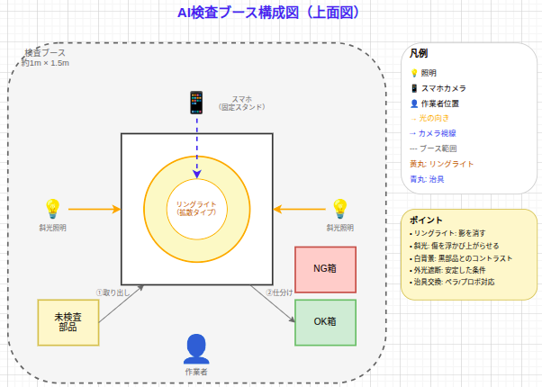
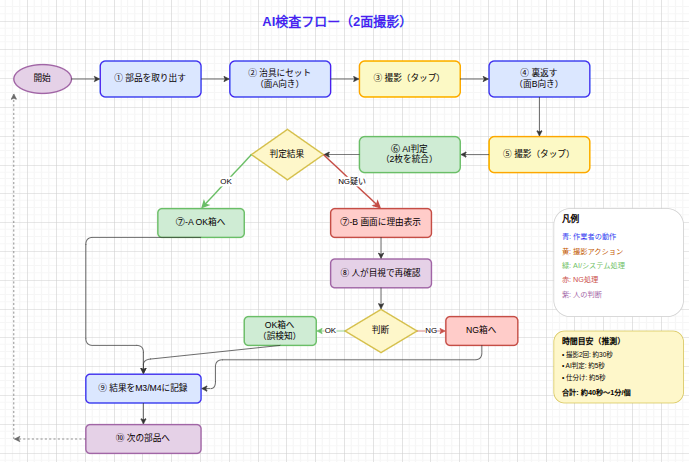
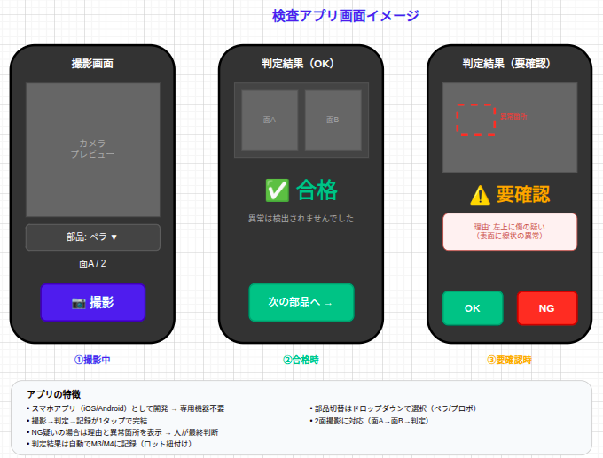

# AI検査システム 1次報告

**報告者**: 藤田
**日付**: 2026年3月18日

---

# 結論

## **金額の見積もりは出せる（概算）**

| 項目 | 金額 | 根拠 |
|------|------|------|
| 撮影環境構築 | 10〜30万円 | 照明・カメラ・治具の市場価格 |
| システム開発 | 100〜300万円 | 1〜3人月相当（詳細見積もり未実施） |
| AI学習・チューニング | 50〜100万円 | 0.5〜1人月相当 |
| **合計** | **160〜430万円** | |

## **効果が見合うかは今の時点ではわからない**

- 削減効果の試算（500台/年）: 年間11万円（検査工数74%削減、38h/年削減）
- 回収年数の試算: 160〜430万円 ÷ 11万円 = **15〜39年**
- 1万台/年なら: 160〜430万円 ÷ 230万円 = **1〜2年**で回収
- **これは仮定に基づく概算であり、実際の効果は検証が必要**

---

# じゃあどうするか: 最小投資で始める

**対象**: プロポ・ペラなど、外観検査の自動化効果が高いと思われる部品

## **M3/M4ツール（確定）**

- 検査記録DBの構築
- 記録が残る → 追跡可能に
- Excelより入力しやすく

## **+ AI検査（検討中）**

- Amazon Bedrockで画像判定
- 検査工数 **74%削減** ※推測
- 判定基準の均一化

※74%削減の根拠: 目視3分/個 → AI導入後0.7分/個（撮影0.5分+確認0.2分）と仮定。現場実測は未実施。

## **提案: 2-3年で回収できる規模で始める**

| 項目 | 金額 | 備考 |
|------|------|------|
| 今年度（原理検証） | **10-20万円** | 人件費のみ、数ヶ月で回収可能 |
| フル導入（将来） | 160-430万円 | 500台規模で3-8年、1万台で数ヶ月で回収 |

---

# 検査ブースの構成

---

# 検査フロー（2面撮影）

---

# 検査アプリ画面イメージ

---

# 背景・きっかけ

## 宇枝部長からの問い合わせ

- 「AIを使った外観検査は導入できないか？」
- 将来増産となった場合に向けた検討

## 調査期間

- 2026年3月18日（約1日）
- コスト試算、技術調査、不良パターン分析を実施

---

# なぜ検査を強化するのか（リスクの観点）

## 1:10:100ルール

| 発見段階 | 相対コスト |
|----------|-----------|
| 設計段階 | **1** |
| 製造段階 | **10** |
| 市場流出後 | **100** |

**→ 早期発見が最もコスト効率が良い**

## 市場流出時のリスク（UAV特有）

- **墜落事故**: 人身事故、PL法リスク
- **リコール**: 全出荷分の回収コスト
- **ブランド毀損**: 長期的な売上影響
- **規制対応**: 航空局への報告義務

**早期発見の仕組み（M3/M4 + AI検査）= リスクヘッジ** → 工数削減だけでなく、**流出リスクの低減**が本質的な価値

---

# 本質的な要求（Need）

**変えられない本質**: 不良品の市場流出を防ぎ、発生時に追跡できる状態にする

**その他の要求**: できるだけコストをかけずに実現したい

## M3/M4ツールは確定、AI検査は検討中

### **M3/M4ツール（確定）**

- 記録・追跡の仕組みを作る
- 不良発生時の原因特定を早める
- **Excelより記録しやすい → 時間短縮**
- **データが溜まる → 分析可能に**

### **+ AI検査（検討中）**

- M3/M4に加えてAI画像判定
- 検査工数の削減も狙う
- **課題**: 効果が見合うか要検証

**AI検査の効果は「やってみないとわからない」部分が大きい**

金額は出せるが、見合った効果になるかは今の時点ではわからない

---

# なぜM3/M4が先か

## **現状の問題: 記録が取れていない → 追跡できない**

- 不良が発生しても、いつ・どこで・どのロットか追えない
- 原因特定に時間がかかる（現状: 平均2時間/件）
- **既に流出問題が発生している**（Session 52 小笠原さんフィードバック）
- 流出1件あたりのコスト: 約4-5時間/件（1.2-1.5万円）

## **M3/M4で解決できること**

- 検査記録が残る → 追跡可能に
- 不良発生時の原因特定が早くなる
- AI検査の判定結果も記録に残せる（将来の拡張）

**AI検査はM3/M4の上に載せる機能** → 記録基盤が先、AI検査は拡張として追加

---

# 調査結果サマリー

## **AI検査の位置づけ**

- M3（受入検査DB）/ M4（工程不良DB）の一部として統合
- 独立システムではなく、既存フローに組み込み

## **推奨サービス**

- **Amazon Bedrock**（生成AI）
- 学習データ不要で導入可能
- プロンプトで判定基準を指定
- **懸念**: 精度は要検証（専用学習モデルより劣る可能性）

## 対象部品（優先度高）

| 部品 | 理由 |
|------|------|
| **プロポ** | 画像分析が容易、判定基準が比較的明確 |
| **ペラ** | 外観検査の主要対象、不良パターンが多い |

※対象部品の優先度は仮定。小笠原さんへのヒアリング未実施。

---

# コスト試算の前提

## 工数削減効果の計算

| 項目 | 現状（目視検査） | AI導入後 |
|------|-----------------|----------|
| プロポ外観検査 | 3分/個 ※推測 | 撮影0.5分 + AI確認0.2分 ※推測 |
| ペラ外観検査 | 3分/個 ※推測 | 撮影0.5分 + AI確認0.2分 ※推測 |
| 月間工数（500台） | 約21時間 | 約5.5時間 |
| 月間工数（1万台） | 約427時間 | 約67時間 |

※現場実測は未実施。部品を手に取り、各面を確認し、記録する時間を含めて3分と推測。

## 初期投資の内訳（概算）

| 項目 | 内容 | 金額 | 根拠 |
|------|------|------|------|
| 撮影環境構築 | 照明、カメラ固定治具、背景 | 10〜30万円 | 市場価格 |
| システム開発 | M3/M4統合、撮影UI、API連携 | 100〜300万円 | 1〜3人月 |
| AI学習・チューニング | プロンプト調整、精度検証 | 50〜100万円 | 0.5〜1人月 |
| **合計** | | **160〜430万円** | |

※詳細見積もりは未実施。要件確定後に精緻化が必要。

---

# 損益分岐点の計算

**計算式**: 初期投資 ÷ 年間削減金額 = 回収年数

## 現状規模（500台/年）での削減効果

**計算の前提**（P10参照）:
- 目視検査: 3分/個 × 2部品 = 6分/台 ※推測
- AI導入後: 0.7分/個 × 2部品 = 1.4分/台 ※推測
- 削減: 4.6分/台

| 項目 | 計算 |
|------|------|
| 削減工数 | 4.6分 × 500台 ÷ 60 = **約38時間/年** |
| 削減金額 | 38時間 × 3,000円/時 = **約11万円/年** |

※月間工数（P10）は月500台想定。年500台の場合は上記。

## フル導入の回収年数

| 規模 | 年間削減金額 | 回収年数 | 計算根拠 |
|------|-------------|----------|---------|
| 500台/年 | 11万円 | **15〜39年** | 160〜430万円 ÷ 11万円 |
| 1万台/年 | 230万円 | **0.7〜1.9年** | 160〜430万円 ÷ 230万円 |

**結論**: 年500台では回収が難しい。まず最小投資（原理検証10-20万円）で効果を確認し、増産時に拡大を検討

※時給3,000円は社内標準工数単価を想定。検査時間3分/個は推測値、現場実測が必要。

---

# API利用料（年間運用費）

## Amazon Bedrock利用料の試算

| 項目 | 計算 | 金額 |
|------|------|------|
| 1画像あたり | 入力2,100トークン + 出力500トークン | **約3.5円**（Opus 4.6） |
| 500台/年 | 500台 × 2部品 × 3.5円 | **約3,500円/年** |
| 1万台/年 | 1万台 × 2部品 × 3.5円 | **約7万円/年** |

※出典: Anthropic公式価格（2026年3月）。Opus 4.6: 入力$5/MTok, 出力$25/MTok。画像は約1,600トークン。

**API利用料は無視できるレベル**（初期投資・人件費に比べて極めて小さい）

## コストの大部分は…

| 項目 | 金額（概算） | 割合 |
|------|-------------|------|
| システム開発（人件費） | 100〜300万円 | 約68% |
| AI学習・チューニング | 50〜100万円 | 約25% |
| 撮影環境構築 | 10〜30万円 | 約7% |
| API利用料 | 0.3〜7万円 | 約0.1% |

---

# 懸念点

## **数字の根拠**

- 検査時間3分/個は推測値（実測なし）
- → **次のアクションで現場ヒアリング・実測が必要**

## **判定基準の属人化**

- 「個人主観」「都度判断」が多い
- AIに明確な基準を教えられない

## **効果予測困難**

- 学習データ量と精度の関係が不確実
- 「やってみないとわからない」部分が大きい

## **人員確保**

- M4が最優先（既に流出問題発生）
- AI検査に時間を割くと他が遅れる

---

# 今年度の提案

## **方針: お金をかけずに小さく始める**

| 項目 | 内容 | 投資額 | 根拠 |
|------|------|--------|------|
| 今年度 | 原理検証プロトタイプ | **約10-20万円** | 人件費のみ（1-2週間） |
| 目的 | 効果の確認、技術習得 | - | - |
| 回収見込み | 1-2年 | 11万円/年 | 検査工数38h/年削減×3,000円 |

## プロトタイプの内容

1. Amazon Bedrock APIへの接続確認（API利用料: 数百円程度）
2. プロポ/ペラ画像の判定テスト
3. 精度の簡易評価

**ポイント**: まず**10-20万円の原理検証**から始める

効果が確認できれば段階的に拡大、効果が出なければ撤退コストも最小

フル導入（160-430万円）の場合: 500台/年では回収困難（15-39年）、1万台/年なら1-2年で回収可能

---

# 他ミッションとの兼ね合い

## 藤田の担当ミッション

| ミッション | 内容 | 優先度 |
|------------|------|--------|
| M1-A | LiDAR評価手法策定 | 中 |
| M1-B | GNSS評価手法策定（RTK検査ツール作成中） | 高 |
| M2 | 点群データ検証方法策定 | 低 |
| M3 | 受入検査DB化 | 中（⏸️ストップ中） |
| **M4** | **工程不良DB化** | **最優先** |

**制約**: M4は既に流出問題が発生しており、最優先で対応が必要（Session 52で決定）

AI検査に時間を割くと、他ミッション（特にM4）が遅れる

---

# 次のアクション

## **調整事項**

- [ ] 原理検証プロトタイプの時期調整（M4との兼ね合い）
- [ ] 1万台規模の見通し確認

## **準備事項**

- [ ] 判定基準の明確化（ヒアリング）
- [ ] プロポ/ペラのサンプル画像収集
- [ ] **検査時間の実測**（プロポ・ペラ各10個程度）
- [ ] **年間の不良対応件数の確認**

## **結論**

1. **まずM4（記録・追跡基盤）を優先**
2. AI検査は**最小投資（10-20万円）で原理検証** → 1-2年で回収（年11万円削減）
3. 効果確認後、増産時に拡大を検討

