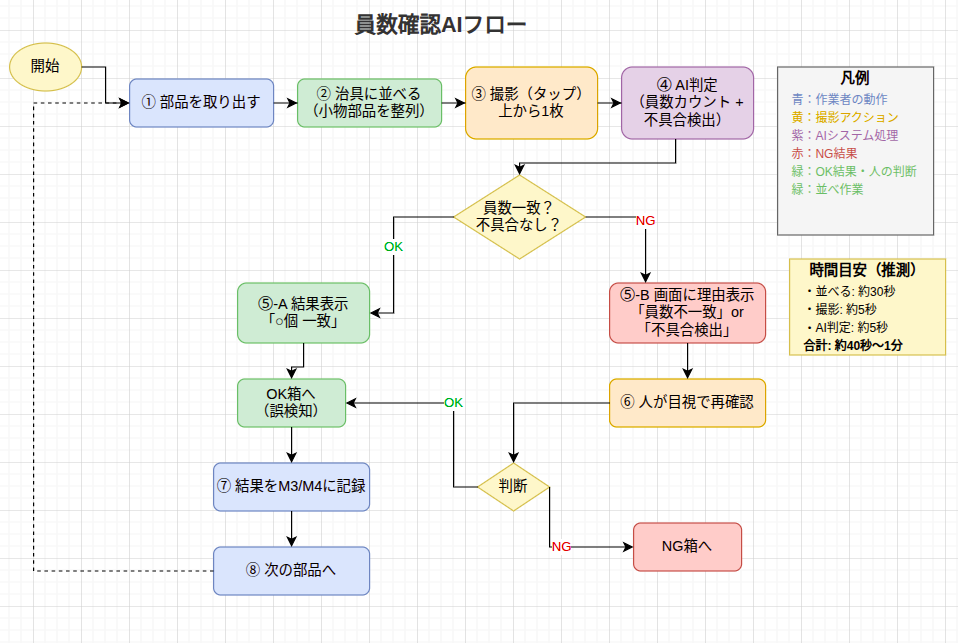
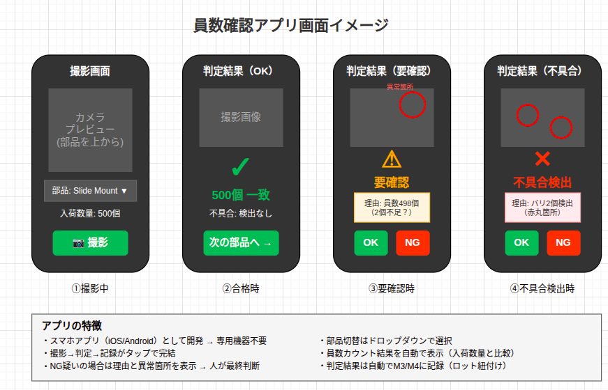

<!-- _class: lead -->
# 員数確認AI化 検討資料

**品質グループ FY2026**

2026年3月18日
Session 258作成

---

# 背景と方向転換

## 外観検査AI化の検討結果

| 項目 | 結果 |
|------|------|
| 年間製造台数 | 500台/年 |
| 対象部品 | プロポ、ペラ |
| 回収年数 | 66〜178年（現実的でない） |

**結論**: 外観検査のAI化は、500台/年規模では投資回収困難

---

# 新アプローチ: 員数確認のAI化

## 提案の背景

外観検査よりも**員数確認**の方が効果が見込める理由:

1. **数量が多い**: 500〜2,500個/回の部品が存在
2. **時間がかかる**: 最大400分（6.7時間）の検査工数
3. **シンプルな判定**: 「個数が合っているか」は明確

---

# 現状の員数確認（Excelデータより）

## 統計

| 項目 | 値 |
|------|-----|
| 員数確認対象部品 | 53種類、73件 |
| 検査工数 平均 | 87.8分 |
| 検査工数 中央値 | 70分 |
| 検査工数 最大 | **400分（Slide Mount 500個）** |

---

# 工数上位部品（AI化効果大）

| 品名 | 入荷数量 | 検査工数 | 効果 |
|------|----------|----------|------|
| Slide Mount | 500個 | 400分 | ★★★ |
| スライドポスト | 1,600個 | 240分 | ★★★ |
| Arm fixed holder | 591個 | 240分 | ★★★ |
| Slido post | 600個 | 220分 | ★★☆ |
| U-shaped grommet W | 1,000個 | 180分 | ★★☆ |
| Ball_valve_mount | 400個 | 160分 | ★☆☆ |

**上位6部品だけで1,440分（24時間）の検査工数**

---

# AI員数確認のフロー

---

# 撮影ブース構成（外観検査と共通）

| 要素 | 仕様 |
|------|------|
| 照明 | リングライト + 斜光照明 |
| 背景 | 白/グレー マット |
| カメラ | スマホ（固定スタンド） |
| サイズ | 約1m × 1.5m |

**ポイント**: 外観検査用に検討したブースをそのまま流用可能

---

# アプリ画面イメージ

---

# コスト試算（概算）

## 前提条件

| 項目 | 値 | 備考 |
|------|-----|------|
| 時給 | 1,700円 | 現行の目視検査 |
| API利用料 | 約3.5円/画像 | Opus 4.6 |
| 撮影回数 | 1回/部品 | 員数確認の場合 |

## 上位6部品での削減見込み（推測）

| 項目 | 現状 | AI化後 | 削減 |
|------|------|--------|------|
| 検査時間 | 1,440分/ロット | ？分 | ？ |

**注**: 田原さんヒアリング後に具体的な数値を確定

---

# 田原さんヒアリング項目

## 確認したいこと

1. **現状の作業フロー**
   - 袋から出す→並べる→数える→戻す？
   - 1回あたり何分かかる？

2. **対象部品について**
   - よく員数確認する部品は？
   - 数え間違いが起きやすい部品は？

3. **撮影によるカウントの可能性**
   - 机に並べて撮影する方式は現実的？
   - 撮影スペース（A3程度）は確保できる？

---

# 不具合検出の付加価値

## 員数確認と同時に検出可能な不良

| 不良の種類 | 検出可能性 |
|------------|-----------|
| バリ | ○ 画像で検出しやすい |
| 変形 | ○ 形状の異常を検出 |
| 異物混入 | ○ 色・形状の違い |
| 傷 | △ 照明条件次第 |

**メリット**: 員数確認のついでに不良検出 → 工程内流出リスク低減

---

# 次のステップ

## 今週

- [ ] 田原さんヒアリング（工数・フロー確認）
- [ ] 優先対象部品の特定

## 来週以降（ヒアリング結果次第）

- [ ] 原理検証プロトタイプ作成（1週間程度）
- [ ] 実部品での精度確認
- [ ] ROI再計算

---

# まとめ

## 提案

**員数確認のAI化**を優先的に検討する

## 理由

1. 外観検査は500台/年規模では回収困難
2. 員数確認は工数上位部品で効果大（1,440分/ロット）
3. 撮影ブースは外観検査と共通で流用可能
4. 不具合検出の付加価値も期待できる

## 次のアクション

**田原さんヒアリング** → 実態把握 → ROI再計算

---

<!-- _class: lead -->
# Appendix

---

# Appendix A: 員数確認対象部品（全53種類）

## 大量入荷（500個以上）

| 品名 | 入荷数量 | 検査工数 |
|------|----------|----------|
| Franged coller φ8.5 φ3.1 | 2,500 | 120分 |
| スライドポスト | 1,600 | 240分 |
| U-shaped grommet W | 1,000 | 180分 |
| Arm grommet | 800 | 60分 |
| Slido post | 600 | 220分 |
| Slide Mount | 500 | 400分 |

---

# Appendix B: 関連資料

| 資料 | 内容 |
|------|------|
| [all-parts-list.md](../session257/all-parts-list.md) | 全部品種類リスト（205種類） |
| [hearing-items-tahara.md](../session257/hearing-items-tahara.md) | 田原さんヒアリング項目 |
| [ai-inspection-report.md](../session252/ai-inspection-report.md) | 外観検査AI化の検討結果 |
| [counting-inspection-flow.drawio](counting-inspection-flow.drawio) | 員数確認フロー図 |

---

# Appendix C: 外観検査との比較

| 観点 | 外観検査 | 員数確認 |
|------|----------|----------|
| 対象部品 | プロポ、ペラ | 小物部品（グロメット等） |
| 撮影回数/台 | 10回 | 1回/部品 |
| 判定内容 | 傷・汚れの有無 | 個数カウント |
| 投資回収 | 66〜178年 | **要計算** |
| 付加価値 | - | 不具合検出も可能 |

---

*作成: Session 258 (2026-03-18)*
