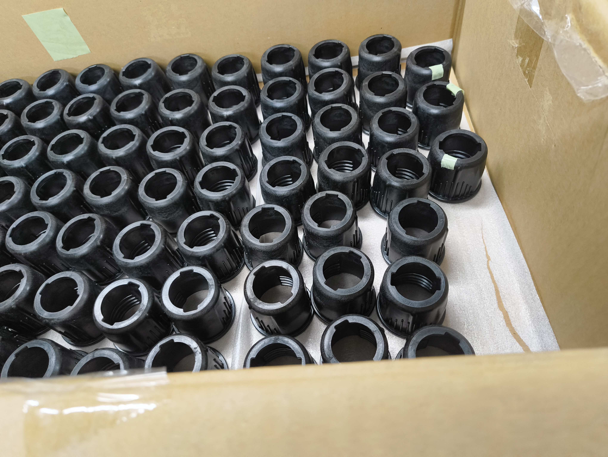
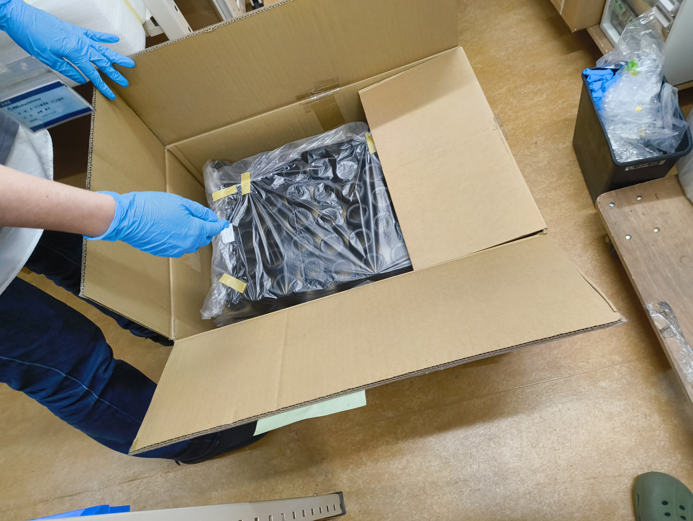

# 受入検査業務改善
## 方針報告

<br>

**2026年3月25日**

品質保証グループ　藤田

---

# 本日のアジェンダ

<br>

| # | 内容 |
|:---:|------|
| 1 | もともとの要求の確認 |
| 2 | AI化の検討結果 |
| 3 | 現場調査での発見 |
| 4 | 今年の目標 |
| 5 | 根本解決策 |
| 6 | 今後の進め方 |

---

# 1. もともとの要求

## 宇枝部長からの問いかけ（2026年2月）

> 「良くなったか見たい」「原因確認したい」

<br>

## 本質的な要求（Need）

**不良品の市場流出を防ぎ、発生時に追跡できる状態にする**

| 現状の課題 |
|-----------|
| ロット概念がない |
| 記録がデータになっていない |
| 問題発生時に追跡できない |

---

# 2. AI化の検討結果

## 検討したAI化の対象

| 対象 | 内容 | 期待効果 |
|------|------|---------|
| **外観検査AI** | プロポ・ペラの外観検査を自動化 | 属人化解消、判定の均一化 |
| **員数確認AI** | ガスケット等の小物部品をAIでカウント | 数え間違い防止、時間短縮 |

<br>

## 検討期間

- 2026年3月：集中的に調査・コスト試算を実施

---

# 2. AI化のコスト試算

## 初期投資（概算）

| 項目 | 金額 |
|------|-----:|
| 撮影環境構築 | 10〜30万円 |
| システム開発（M3/M4統合） | 100〜300万円 |
| AI学習・チューニング | 50〜100万円 |
| **合計** | **160〜430万円** |

<br>

※ Amazon Bedrock（Claude）を想定：学習データ不要、低導入ハードル

---

# 2. AI化の回収年数

<div class="columns">
<div>

| AI化対象 | 回収年数 | 判定 |
|---------|--------:|:----:|
| 外観検査AI | **15〜39年** | ❌ |
| 員数確認AI | **21〜58年** | ❌ |

</div>
<div style="font-size: 22px;">

**計算根拠**

- 初期投資: 160〜430万円
- 年間削減効果:
  - 外観検査: 約11万円/年
  - 員数確認: 約7.5万円/年

※ 500台 × 検査時間短縮で試算

</div>
</div>

## 結論

> **年間500台規模では効果が出せない**
> 「結局人が関わってやる方が安く済む」（小笠原さん）

---

# 3. 現場調査での発見

## 2026年3月 田原さんヒアリング実施

**想定**していた作業フロー:
```
入荷 → 受入検査（員数確認）→ 入庫 → 出庫
```

**実態**:
```
入荷 → 開封 → 検査 → 梱包変更 → 入庫 → 小分け変更 → 出庫
                        ↑                  ↑
                    隠れコスト          隠れコスト
```

※ 出庫先によって小分け単位が違うため、再度小分けし直しが発生

---

# 3. 隠れコストの発見

## 可視化されているコスト

- 受入検査の時間（Excelに記録）

## 隠れコスト（可視化されていない）

| 作業 | 状態 |
|------|------|
| 開封作業 | 記録なし |
| **梱包変更作業**（小分け、袋詰め） | 記録なし |
| 出庫前の小分け作業 | 記録なし |

→ **Excelで「たまたま数字になっていた」のは受入検査だけ**

---

# 3. 現場写真：入荷時の梱包状態



ダンボール板で並べて梱包 → **ロット数がわかりにくい**

---

# 3. 現場写真：梱包変更後



小分けしてビニール袋に入れ直し → **「48pcs」等と記入**

---

# 3. 問題の構造：測定バイアス

## 「測定しやすいもの」だけを測定していた

| 作業 | 可視化 | 記録 |
|------|:------:|------|
| 受入検査 | ✅ | Excelあり |
| 梱包変更作業 | ❌ | なし（隠れコスト） |
| 出庫前小分け | ❌ | なし（隠れコスト） |

<br>

→ **全体のコストが把握できていない状態**

---

# 4. 今年の目標：可視化に注力

## 理由

**まだ何も数字になっていない**

## Phase 1 の目標（〜6月）

| 項目 | 状態 |
|------|:----:|
| 作業フロー全体の可視化（SIPOC） | ✅ 完了 |
| 暗黙知の外部化 | 進行中 |
| 隠れコストの特定と定量化 | 進行中 |

---

# 4. 作業フローの可視化（SIPOC）


受入検査の11プロセスを特定、**梱包変更作業**を明示化

---

# 5. 根本解決策：梱包仕様の標準化

## 現状の問題

- 納品時の梱包 → 組立業者への出庫に適していない
- うちで**梱包変更作業**が発生

## 解決策（長期）

| 施策 | 効果 |
|------|------|
| 納品時の梱包仕様を出庫に適した形に統一 | 梱包変更作業を省略 |
| 業者との調整 | 時間をかけて実施 |

---

# 6. 今後の進め方

## 3フェーズ構成

| Phase | 期間 | 目標 |
|-------|------|------|
| **Phase 1** | 〜6月 | 現状可視化（作業フロー・隠れコスト） |
| **Phase 2** | 7月〜 | ムダ特定（VSM作成、8つのムダ分析） |
| **Phase 3** | - | 解決策策定（ベンダー管理、梱包標準化） |

<br>

**今年はPhase 1〜2に注力**

---

# まとめ

## 本日の報告内容

1. **AI化は500台規模では効果が出ない**（回収15-58年）
2. **隠れコストが存在する**（梱包変更作業等）
3. **今年は可視化に注力**（Phase 1: 〜6月）
4. **根本解決策は梱包仕様の標準化**（長期）

<br>

## お願いしたいこと

- **Phase 1（可視化）への取り組み継続の承認**

---

# ご清聴ありがとうございました

<br>
<br>

## 質疑応答
