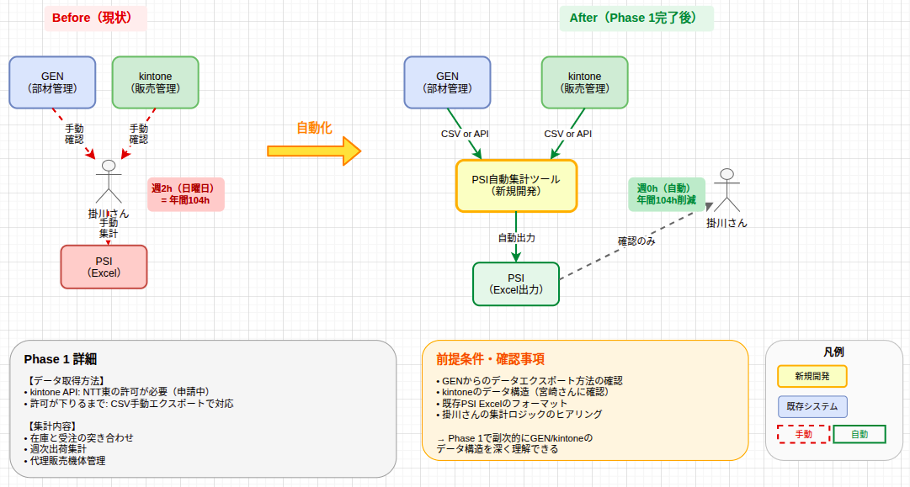
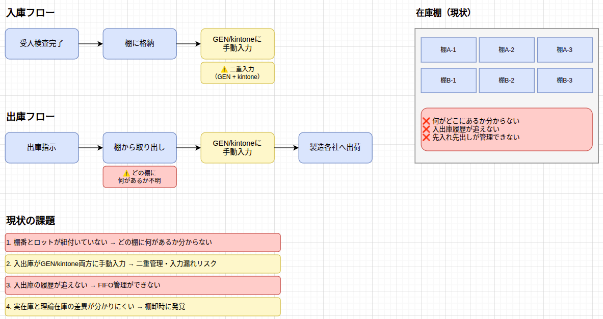
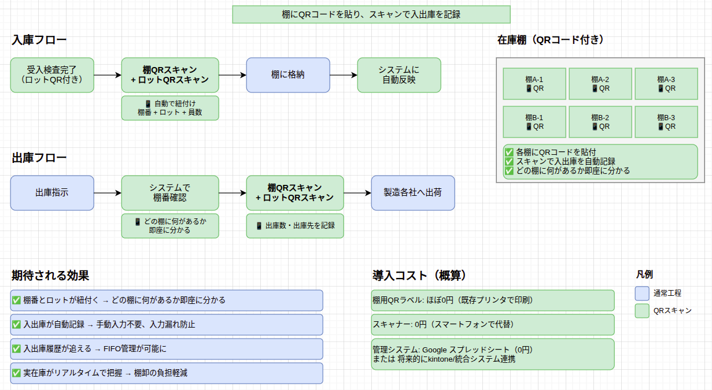
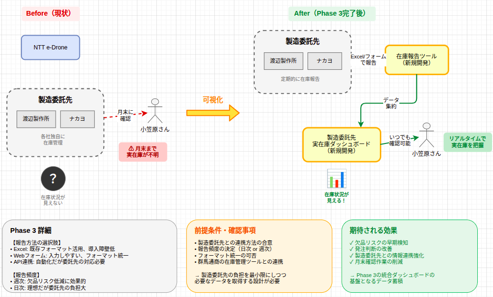
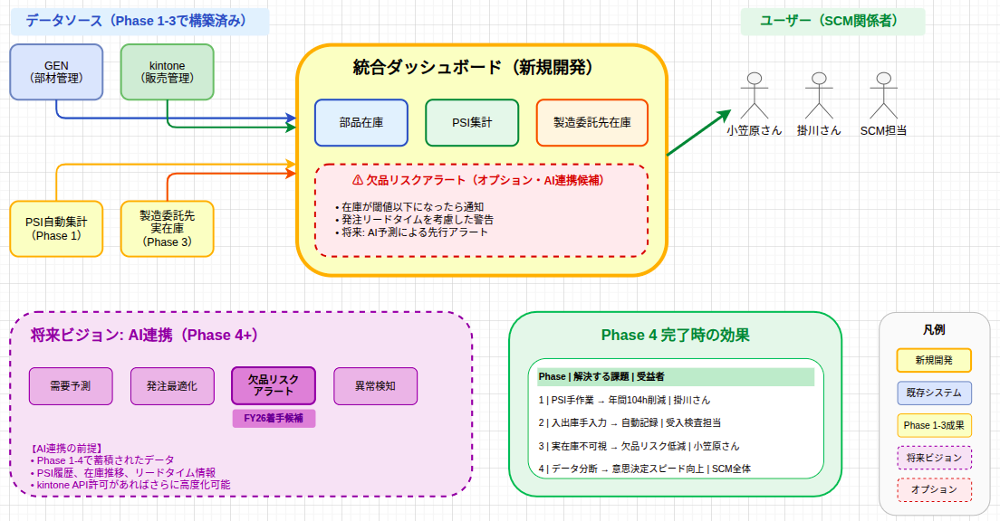

# 業務改善・DX施策
## 方針報告

 

**2026年3月25日**

品質保証グループ　藤田

---

# 本日のアジェンダ

 

| # | 内容 |
|:---:|------|
| 1 | 3月の調査結果 |
| 2 | 現状の業務フロー |
| 3 | 発見した課題 |
| 4 | 理想像 |
| 5 | FY26 ロードマップ（4フェーズ） |
| 6 | kintone契約方式 |

---

# 1. 3月の調査結果

| 項目 | 結果 |
|------|------|
| 現場調査 | 田原さん・小笠原さん・掛川さんへ聞き取り |
| 業務フロー可視化 | SIPOC作成（11プロセス特定） |
| AI化検討 | 和田さんが検討継続中（藤田検討分は費用対効果出ず） |

 

→ **業務フロー改善を優先**

---

# 2. 現状の業務フロー

---

# 3. 発見した課題と数字

## 聞き取りで判明した定量的な課題

 

### 掛川さんのPSI集計作業

| 項目 | 内容 |
|------|------|
| 頻度 | 毎週日曜日 |
| 時間 | **週2時間（サービス残業）** |
| 年間換算 | **年間104時間** |
| 内容 | kintone → PSI(Excel)への手動転記 |

---

# 3. 小笠原さんが感じている一番の課題

 

> **「製造委託先（ワタナベ・ナカヨ）の実在庫が見えない」**

 

| 現状 | 問題点 |
|------|--------|
| 月末に「仕損情報」が届く | 月中は理論在庫のみ |
| 理論在庫と実在庫の差分が月末まで不明 | 欠品・過剰在庫のリスク |

---

# 4. 理想像：統合在庫管理システム

---

# 5. FY26 ロードマップ：4フェーズ構成

 

| Phase | 名称 | 受益者 | 効果 |
|:-----:|------|--------|------|
| 1 | **集計業務の自動化** | 掛川さん | 年間104h削減 |
| 2 | **入出庫の自動記録** | 受入検査担当 | 手書き・二重入力の解消 |
| 3 | **委託先在庫の見える化** | 小笠原さん | 欠品リスク低減 |
| 4 | **SCM全体の一元管理** | SCM全体 | 統合ダッシュボード |

 

→ **具体的な課題から着手し、段階的にシステム統合へ**

---

# Phase 1: 集計業務の自動化（4-6月）

---

# Phase 2: 入出庫の自動記録（7-9月）

---

# Phase 2: 入出庫の自動記録（続き）

---

# Phase 3: 委託先在庫の見える化（7-12月）

---

# Phase 4: SCM全体の一元管理（1-3月）

---

# kintone契約方式について

## 現状の制約

| 項目 | 内容 |
|------|------|
| 現在の利用形態 | NTT東日本の基盤上で利用中 |
| API連携 | **NTT東日本の承認が必要** |
| カスタマイズ | NTT東製ノーコードツールのみ |

 

→ **統合在庫管理システムにはAPI連携が必須**

---

# kintone契約方式：対応方針

| 選択肢 | 内容 | 評価 |
|--------|------|------|
| ① NTT東日本の許可取得 | 承認プロセスを経てAPI利用 | 手続きに時間 |
| ② NTTeDT独自契約 | 自社でkintone契約 | **自由にAPI利用可能** |

 

→ **許可取得より独自契約のほうが早い**

**進捗**: 和田さん・宮崎さんが対応中

---

# 導入コスト（概算）

| Phase | 項目 | 費用 |
|:-----:|------|-----:|
| 1 | PSI自動化 | 開発工数のみ |
| 2 | QRコード導入 | 約1-3万円 |
| - | kintone独自契約 | 要確認 |

 

※ kintone独自契約は和田さん・宮崎さんが推進中

---

# ご清聴ありがとうございました

 
 

## 質疑応答

