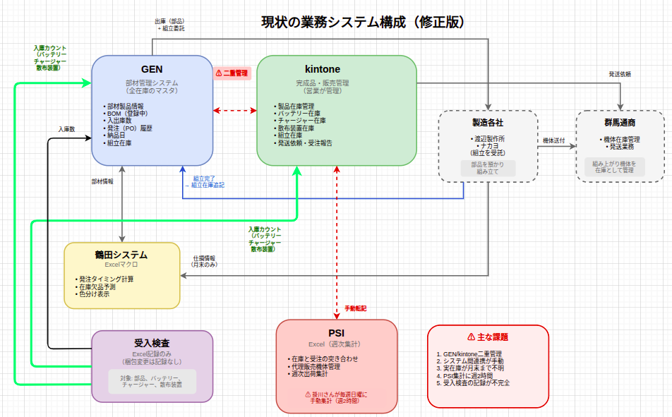
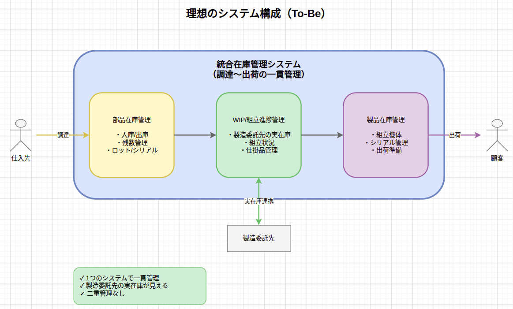
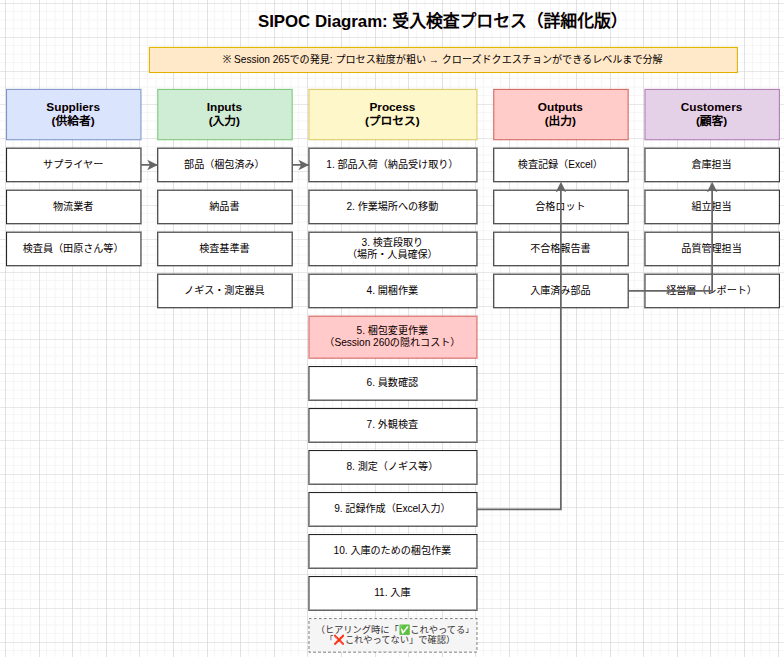

# 業務改善・DX施策
## 方針報告

 

**2026年3月25日**

品質保証グループ　藤田

---

# 調査で見つかった2つの課題

## ① 集計作業の負荷

| 項目 | 内容 |
|------|------|
| 作業 | PSI集計（kintone → Excel手動転記） |
| 頻度 | 毎週末 |
| 時間 | **年間104時間**（週2h × 52週） |

## ② 委託先在庫が見えない

| 現状 | 問題点 |
|------|--------|
| 月末に「仕損情報」が届く | 月中は理論在庫のみ |
| 実在庫との差分が月末まで不明 | 欠品・過剰在庫のリスク |

---

# 現状の業務フロー

---

# 目指す姿

---

# 期待される効果と今後の進め方

 

## 期待される効果

| 施策 | 効果 |
|------|------|
| 集計業務の改善 | 年間104時間削減 |
| 入出庫記録の改善 | 手書き・二重入力の解消 |
| 委託先在庫の可視化 | 欠品リスクの早期検知 |

 

## 今後の進め方

→ **技術的な制約を踏まえ、実現方法を検討中**

---

# 補足：3月の調査活動

| 項目 | 内容 |
|------|------|
| 現場調査 | SCM担当・受入検査担当へ聞き取り |
| 業務フロー可視化 | SIPOC作成（11プロセス特定） |
| AI化検討 | 和田さんが検討継続中 |

---

# 補足：業務フロー可視化（SIPOC）

---

# ご清聴ありがとうございました

 
 

## 質疑応答

