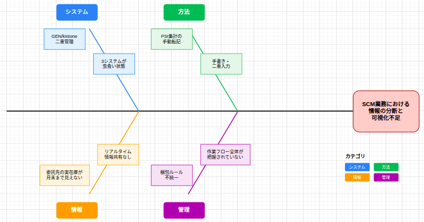
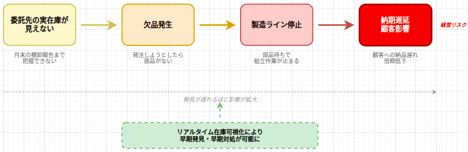

# 業務改善・DX施策
## 方針報告

 

**2026年3月25日**

品質保証グループ　藤田

---

# 調査で見つかった課題

---

# 特に注視すべきリスク：委託先在庫の不可視

---

# 現状の業務フロー

---

# 目指す姿

---

# 現時点の結論

 

## 現状把握が完了していない

- 3月は聞き取り・フロー可視化に注力
- 一番の問題が何か、まだ特定できていない
- 対策を決めるのは時期尚早

---

# 今後の方針

 

| 期間 | 内容 |
|------|------|
| **〜6月末** | 現状把握の調査継続（受入検査は部品点数が多いため） |
| **7月〜** | 調査結果をもとに対策立案 |

 

## 6月末までに明らかにすること

- どこがボトルネックか
- どの業務が最も改善効果が高いか
- 技術的な制約（GEN/kintone連携の可否）

---

# 補足：3月の調査活動

| 項目 | 内容 |
|------|------|
| 現場調査 | SCM担当・受入検査担当へ聞き取り |
| 業務フロー可視化 | SIPOC作成（11プロセス特定） |
| AI化検討 | 品質基準書を作成し、作業効率化を検討中。メーカー2社に和田さんから問い合わせ中 |

---

# 補足：業務フロー可視化（SIPOC）

---

# ご清聴ありがとうございました

 
 

## 質疑応答

