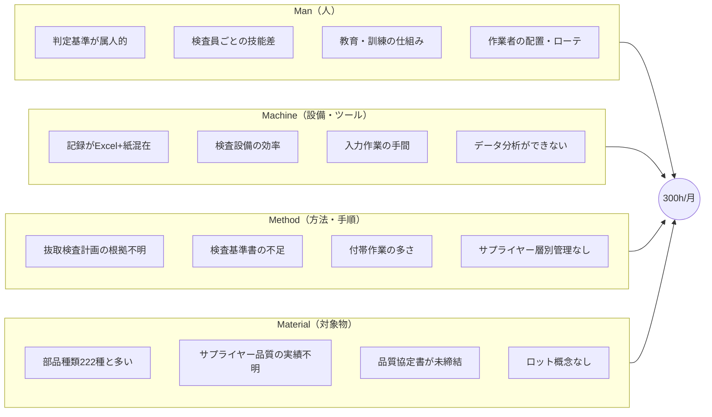

# 特性要因図: なぜ受入検査に300h/月かかるのか

**作成日**: 2026-03-09
**目的**: 4M分析で検査工数の要因を構造化し、一次調査で検証する項目を明確化

---

## 結論（Problem Statement）

> **300hが「多すぎるのか適切なのか」を判断する根拠がない**

検査の有効性（不良流出をどれだけ防いでいるか）が定量的に評価できていない。

---

## 特性要因図（Mermaid）



---

## 詳細要因リスト（確認済み / 仮説）

### Man（人）

| # | 要因 | 状態 | エビデンス / 確認方法 |
|---|------|------|----------------------|
| M1 | **判定基準が属人的** | ✅確認済 | Session 6: 「何がNGなのか明文化されていない」「検査基準書は部分的」 |
| M2 | 検査員ごとの技能差 | 🔷仮説 | 一次調査: 検査員は何人いるか、技能差はあるか |
| M3 | 教育・訓練の仕組み | 🔷仮説 | 一次調査: 新人教育はどうしているか |
| M4 | 作業者の配置・ローテ | 🔷仮説 | 一次調査: 1人で全部やっているのか、分業か |

### Machine（設備・ツール）

| # | 要因 | 状態 | エビデンス / 確認方法 |
|---|------|------|----------------------|
| MA1 | **記録がExcel+紙混在** | ✅確認済 | Session 24: 「Excelは杉山さんの記録のみ、他は紙」 |
| MA2 | 検査設備の効率 | 🔷仮説 | 一次調査: 設備待ちで時間がかかっているか |
| MA3 | **入力作業の手間** | ✅確認済 | Session 7: 「入力の簡単さがデータ品質を左右」、表記揺れ多数 |
| MA4 | **データ分析ができない** | ✅確認済 | Session 6: 「記録はあるがデータになっていない」 |

### Method（方法・手順）

| # | 要因 | 状態 | エビデンス / 確認方法 |
|---|------|------|----------------------|
| ME1 | **抜取検査計画の根拠不明** | 🔷仮説 | 一次調査: AQL・サンプルサイズの設定理由は何か |
| ME2 | **検査基準書の不足** | ✅確認済 | Session 6: 「検査基準書がない」「判定基準が暗黙知」 |
| ME3 | **付帯作業の多さ** | 🔷仮説 | 一次調査: 検査以外に何をしているか（運搬、記録、問い合わせ等） |
| ME4 | **サプライヤー層別管理なし** | ✅確認済 | m3-research: 「すべてのサプライヤーがLevel 1（定量根拠がないため）」 |

### Material（対象物）

| # | 要因 | 状態 | エビデンス / 確認方法 |
|---|------|------|----------------------|
| MT1 | **部品種類222種と多い** | ✅確認済 | Session 19: 「品名222種類」 |
| MT2 | **サプライヤー品質の実績不明** | ✅確認済 | m3-research: 「信用できない」を定量的に裏付けるデータがない |
| MT3 | **品質協定書が未締結** | ✅確認済 | Session 25: 「品質協定書が未締結」 |
| MT4 | **ロット概念なし** | ✅確認済 | Session 25: 「現行Excelにはロット概念がない」 |

---

## 一次調査で検証すべき項目（優先順）

| 優先度 | 項目 | 対応する要因 | 確認方法 |
|--------|------|-------------|---------|
| **P0** | 300hの内訳（どの作業に何時間か） | ME3 | 現場観察 + ヒアリング |
| **P0** | 検査員は何人か、1人あたり工数は | M2, M4 | ヒアリング |
| **P1** | 抜取検査計画の根拠 | ME1 | 書類確認 + ヒアリング |
| **P1** | 検査以外の付帯作業の内容 | ME3 | 現場観察 |
| **P2** | 後工程での品質クレーム発生状況 | MT2 | 記録確認 |
| **P2** | サプライヤーごとの品質差 | MT2 | データ分析（M4連携後） |

---

## 要因の相関図

```
                  サプライヤー品質の実績不明 (MT2)
                           ↓
        品質協定書が未締結 (MT3) → 層別管理できない (ME4)
                                          ↓
        ロット概念なし (MT4) ──────→ 抜取計画の根拠不明 (ME1)
                                          ↓
        検査基準書の不足 (ME2) ────→ 判定基準が属人的 (M1)
                                          ↓
        記録がExcel+紙混在 (MA1) → データ分析ができない (MA4)
                                          ↓
                              **改善の優先順位が決められない**
```

---

## この図の使い方

1. **一次調査の前に**: この図を見せて「こういう理解であっているか」を確認
2. **一次調査中**: 「確認済み」を裏付け、「仮説」を検証
3. **一次調査後**: 図を更新し、要因の優先順位を決定

---

## 参照

- [m3-research-key-points.md](../session39/m3-research-key-points.md) — 調査資料の重要ポイント
- [excel-review.md](../session6/excel-review.md) — 現行Excelの課題
- [quality-framework-research.md](../session25/quality-framework-research.md) — 品質管理フレームワーク
